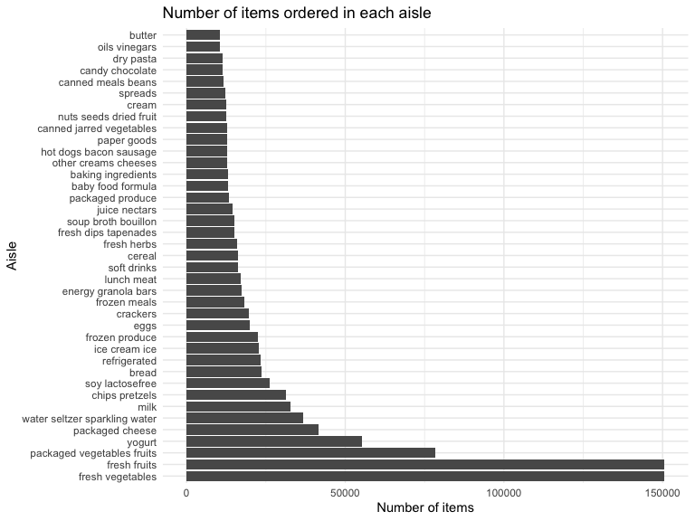
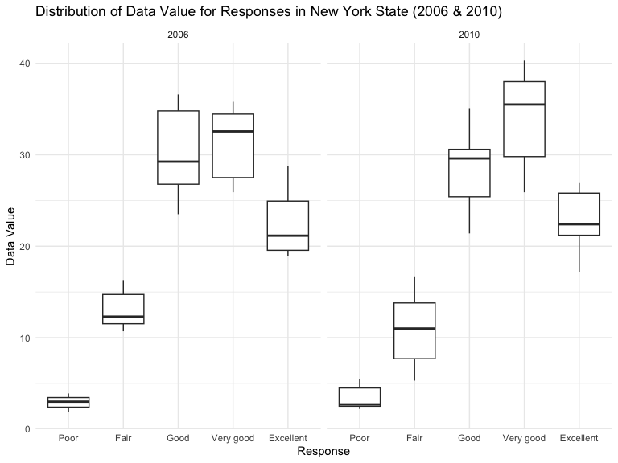

p8105_hw3_xl3371
================
Xuer Liu
2023-10-12

``` r
library(tidyverse)
library(ggplot2)
```

## Problem 1

Load the data for Problem 1

``` r
library(p8105.datasets)
data("instacart")
```

### Short description of the dataset

The `instacart` dataset contains 1384617 observations and 15
variables.  
Examples of key variables in this dataset includes `product_id`,
`user_id`, `product_name`, `aisle_id`, and etc.  

### Number of aisles, and most items ordered from aisles

``` r
instacart_aisle = 
  instacart %>%
  group_by(aisle) %>%
  summarize(n_orders = n()) %>%
  arrange(desc(n_orders))
```

There are 134 aisles. The aisle with the most items ordered is fresh
vegetables with 150609.

### Plot showing the number of items ordered in each aisle

``` r
instacart %>%
  count(aisle) %>%
  filter(n > 10000) %>%
  ggplot(aes(x = reorder(aisle, -n), y = n)) +
  geom_col() +
  labs(title = "Number of items ordered in each aisle", 
       x = "Aisle", 
       y = "Number of items") +
  theme_bw() +
  coord_flip() 
```



### Table showing the three most popular items

``` r
instacart %>% 
  filter(aisle %in% c("baking ingredients", "dog food care", "packaged vegetables fruits")) %>%
  group_by(aisle) %>% 
  count(product_name) %>% 
  mutate(rank = min_rank(desc(n))) %>% 
  filter(rank < 4) %>% 
  arrange(desc(n)) %>%
  knitr::kable()
```

| aisle                      | product_name                                  |    n | rank |
|:---------------------------|:----------------------------------------------|-----:|-----:|
| packaged vegetables fruits | Organic Baby Spinach                          | 9784 |    1 |
| packaged vegetables fruits | Organic Raspberries                           | 5546 |    2 |
| packaged vegetables fruits | Organic Blueberries                           | 4966 |    3 |
| baking ingredients         | Light Brown Sugar                             |  499 |    1 |
| baking ingredients         | Pure Baking Soda                              |  387 |    2 |
| baking ingredients         | Cane Sugar                                    |  336 |    3 |
| dog food care              | Snack Sticks Chicken & Rice Recipe Dog Treats |   30 |    1 |
| dog food care              | Organix Chicken & Brown Rice Recipe           |   28 |    2 |
| dog food care              | Small Dog Biscuits                            |   26 |    3 |

### Table showing the mean hour of the day

``` r
instacart %>%
  filter(product_name %in% c("Pink Lady Apples", "Coffee Ice Cream")) %>%
  group_by(product_name, order_dow) %>%
  summarize(mean_hour = mean(order_hour_of_day)) %>%
  pivot_wider(
    names_from = order_dow,
    values_from = mean_hour) %>%
  knitr::kable(digits = 2)
```

| product_name     |     0 |     1 |     2 |     3 |     4 |     5 |     6 |
|:-----------------|------:|------:|------:|------:|------:|------:|------:|
| Coffee Ice Cream | 13.77 | 14.32 | 15.38 | 15.32 | 15.22 | 12.26 | 13.83 |
| Pink Lady Apples | 13.44 | 11.36 | 11.70 | 14.25 | 11.55 | 12.78 | 11.94 |

## Problem 2

Load the data for Problem 2

``` r
library(p8105.datasets)
data("brfss_smart2010")
```

### Data cleaning

``` r
brfss_clean <- brfss_smart2010 %>%
  janitor::clean_names() %>%
  filter(topic == "Overall Health") %>%
  filter(response %in% c('Excellent', 'Very good', 'Good', 'Fair', 'Poor')) %>%
  mutate(response = 
           factor(response, 
                  levels = c('Poor', 'Fair', 'Good', 'Very good', 'Excellent'), 
                  ordered = TRUE)) 
```

### In 2002, which states were observed at 7 or more locations? What about in 2010?

``` r
# 2002
brfss_clean %>% 
  filter(year == 2002) %>% 
  group_by(locationabbr) %>% 
  summarise(location_count = n_distinct(locationdesc)) %>% 
  filter(location_count >= 7) %>% 
  pull(locationabbr)
```

    ## [1] "CT" "FL" "MA" "NC" "NJ" "PA"

``` r
# 2010
brfss_clean %>% 
  filter(year == 2010) %>% 
  group_by(locationabbr) %>% 
  summarise(location_count = n_distinct(locationdesc)) %>% 
  filter(location_count >= 7) %>% 
  pull(locationabbr)
```

    ##  [1] "CA" "CO" "FL" "MA" "MD" "NC" "NE" "NJ" "NY" "OH" "PA" "SC" "TX" "WA"

In 2002, states includes CT, FL, MA, NC, NJ, and PA were observed at 7
or more locations.  
In 2010, states includes CA, CO, FL, MA, MD, NC, NE, NJ, NY, OH, PA, SC,
TX, and WA were observed at 7 or more locations.

### Construct a dataset that is limited to Excellent responses, and contains, year, state, and a variable that averages the data_value across locations within a state.

``` r
excellent_df = brfss_clean %>%
  filter(response == 'Excellent') %>%
  group_by(year, locationabbr) %>%
  summarise(data_value_mean = mean(data_value, na.rm = TRUE))
```

### Make a “spaghetti” plot of this average value over time within a state

``` r
excellent_plot =
  ggplot(excellent_df, aes(x = year, y = data_value_mean, group = locationabbr, color = locationabbr)) +
  geom_line() +
  labs(title = "Average Value Over Time by State",
       x = "Year",
       y = "Average Value") +
  theme_bw()

excellent_plot
```


### Make a two-panel plot showing, for the years 2006, and 2010, distribution of data_value for responses (“Poor” to “Excellent”) among locations in NY State.

``` r
two_panel_plot = brfss_clean %>%
  filter(locationabbr == "NY" & year %in% c(2006, 2010)) %>%
  ggplot(aes(x = response, y = data_value)) +
  geom_boxplot() +
  labs(title = "Distribution of Data Value for Responses in New York State (2006 & 2010)",
       x = "Response",
       y = "Data Value") +
  facet_wrap(~year, ncol = 2) +
  theme_bw()

two_panel_plot
```



## Problem 3

### Load the datasets
